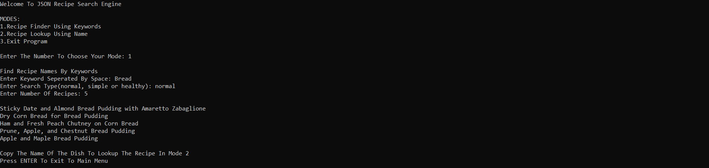
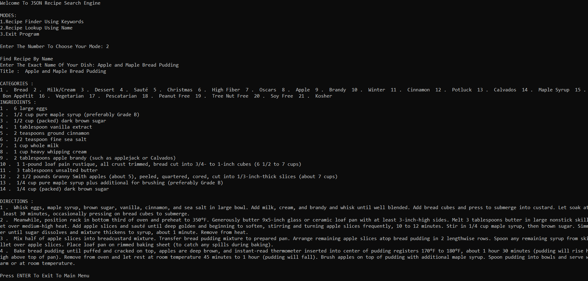

# JSON-Search-Engine-Python
>This is a search engine used to find a recipe name based on the keywords provided and to find complete recipes when the exact name is given.
>There are 2 main modes of using the search engine




## Prerequisite

This game utilises the json, string modules to function:

```python
import json
import string
```

## How To Use 
>To run the search engine, run main.py
>There are 2 modes to choose from 
>1. Recipe Finder Using Keywords
>2. Recipe Lookup Using Name

## Release History

* 1.0.0
    * Final Release
* 0.3.1
    * Bug Fixes
* 0.3.0
    * Improved UI to make unlimited searches and bug fixes
* 0.2.1
    * Added "Recipe not found message" when there was no match.
* 0.2.0
    * Added Recipe lookup mode to display the entire recipe.
* 0.1.2
    * Fix: Program Crash When Recipie Not Found.
* 0.1.1
    * Added a simple console based UI 
* 0.1.0
    * The first proper release (only mode 1)
* 0.0.1
    * Work in progress

## Meta

Hoshner Tavadia – hoshnertavadia@gmail.com

Distributed under the GPL-3.0License. See ``LICENSE`` for more information.

[https://github.com/tavadia-hoshner/](https://github.com/tavadia-hoshner/)
